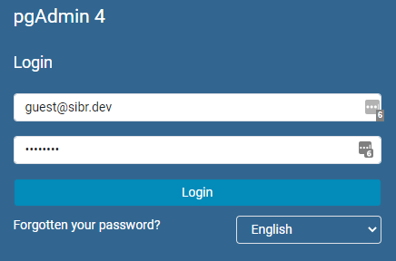
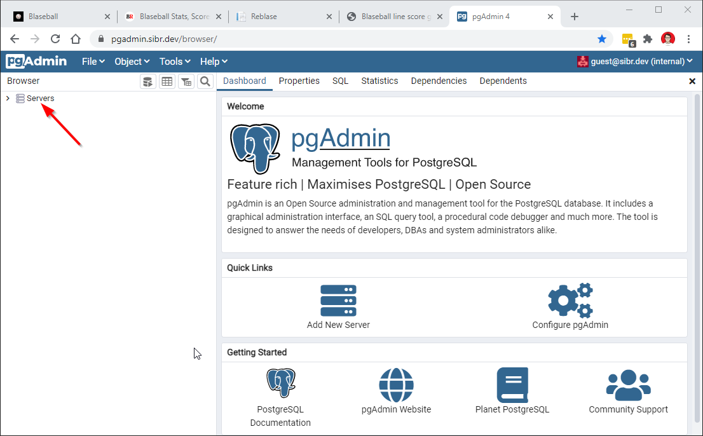
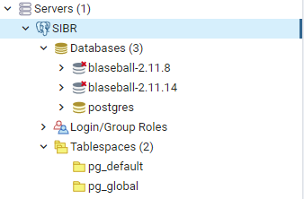
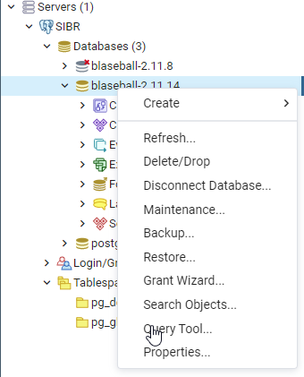
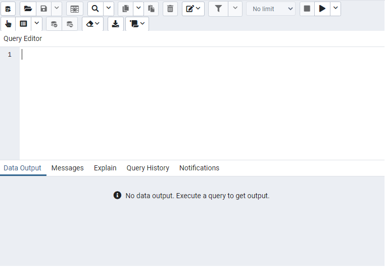
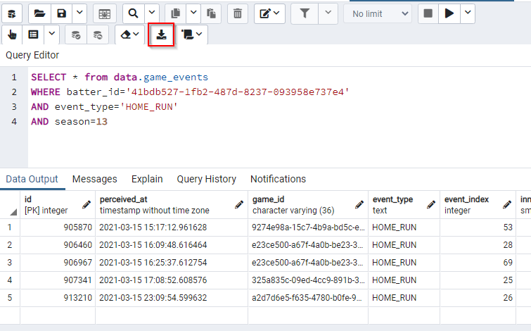

# HOW TO use guest access to the Datablase

If you're somewhat able to write an SQL query, and would like to find out some complex information about historical statistics, Guest Access To The Datablase™ might be for you!

The guest account is limited to *reading* data only so you can't break anything, and it's limited to 10 seconds per query so you can't accidentally lock everybody else out with a whoopsie.

*(If you need a longer timeout, contact us in `#datablase` on the SIBR Discord)*

# Login to pgAdmin

Visit https://pgadmin.sibr.dev/ and log in with username **guest@sibr.dev** and password **salmon**

# Find the latest database

First, expand the **Servers** to see the available servers known to this account.

The SIBR Datablase server should already be in the list. If not, see the **Adding the SIBR server** section below.

Within the SIBR server you'll find several databases - one called **postgres** which is the default and not used by Datablase operations, and one or more named **blaseball-X.Y.Z**.

You should always choose the *highest version number* database - it'll have the freshest, crispiest data from the current season.

# Get to the query tool

To start making queries, simply right-click the database and choose **Query Tool...**

You've now found your home - the pgAdmin Query Tool! Though intimidating at first, you'll come to know and love every nook and cranny of this homey spot.

Simply type a valid SQL query in the top box and hit **F5** to execute and see the results at the bottom!

# An Example

Let's say you want to see all the records of home runs hit by noted Steaks phenom **Zephyr McCloud** during their debut in season 14!

    SELECT * from data.game_events
    WHERE batter_id='41bdb527-1fb2-487d-8237-093958e737e4'
    AND event_type='HOME_RUN'
    AND season=13

*Pro tip: Blasebot's `bb!player` command is great for finding player IDs!*

Voila! You've run your first query and gotten some results!
You can download your results with the **Download as CSV/TXT** button marked above, or just copy and paste things you need from the query results.

# Next Steps

The Datablase is a PostgreSQL database, a long-running and stable technology with *lots* of tutorials and help documentation available. If you study up on how to construct queries you'll be doing complex stuff in no time!

And then if you get really good you can take over this project from us!

If you want to get into the details, read on for...

# Datablase Structure

## The Basics

There are three schemas:
* `public` is used only by the Evolve database migration library; you should ignore it.
* `data` is where all the tables and views live that are populated with piping-fresh data by **prophesizer**.
* `taxa` is where miscellaneous other information lives (like preferred team abbreviations, definitions of blood types, vibe formulas, etc) and is used to cross-reference and make the views nice and readable.

In 99% of cases you'll want to query tables or views in the `data` schema - that's where all the delicious golden-brown statistics are.

## Significant Tables
The tables in the datablase are where raw data lives. If you want higher-level calculated data like statistics or team rosters, look ahead to the Notable Views section.

Tables are updated once per minute with the latest data available from **Chronicler** so they should be within *a few* minutes of LIVE.

### `data.games`
The schedule! Every game we could find out about from blaseball.com, with odds, weather, scores, and even the winning & losing pitchers, plus more.

### `data.teams`
The historical record of what each team has looked like *throughout the time we've been archiving*. This means yes, we have records for Mexico City Wild Wings, Wexico City Mild Wings, *and* Mexico City Mild Wings.

Records in this table have a `valid_from` and `valid_until` timestamp that describe when the record was accurate.

In order to see the *current* teams, you'll need to query for records `WHERE valid_until IS NULL`.

### `data.players`
The historical record of what each player has looked like *throughout the time we've been archiving*. This means yes, we have 31 separate entries for Wyatt Mason / NaN.

Records in this table have a `valid_from` and `valid_until` timestamp that describe when the record was accurate.

In order to see the *current* state of any players, you'll need to query for records `WHERE valid_until IS NULL`.

### `data.game_events`
 The big Kahuna where each at-bat (mostly) gets stored. This table drives nearly all our derived statistics.
 
 A Datablase "game event" includes multiple pitches up until the point where, roughly speaking, Something Happened. The most obvious example is a hit, or strikeout, or walk. But the game event can also be completed by things like a stolen base - in these cases, the at-bat just continues in the next game event.

 This setup is somewhat awkward for measuring pure at-bats; but it's based on how Retrosheet records MLB games, and we haven't come up with a better system thus far.

 Notable columns:
 
 * `event_type` - a string like HOME_RUN or WALK or IMMATERIA_SWEPT... y'know, normal baseball stuff
 * `batter_id` and `pitcher_id` - IDs for the batter and pitcher - you can JOIN with `data.players` for names
 * `event_text` - list of all original text that is grouped into this event
 * `season`, `day`, `game_id` - pretty self-explanatory but important

 ### `data.game_event_base_runners`

 A child table of `data.game_events` - each record in this table is linked to a record in `game_events` by its ID.

 These records show what each baserunner did during the corresponding game event - including what bases they started and ended on, whether they were stealing or scored or whatever.

 Please note that one game event might have multiple baserunner records associated with it.

### `data.outcomes`

Another child table of `data.game_events` linked to it by the game event ID, this table records when various "Outcomes" (like blooddrain sips or shellings) occurred.

The Datablase has many more outcomes recorded than the Feed shows on the official site, so this may be useful.

Please note that one game event might have 2 or 3 outcomes associated with it. 

## Notable Views

TODO... for now, please ask in the `#datablase` channel on the SIBR Discord for help deciphering what all these crazy views are.

## Appendix: Adding the SIBR Server

Please contact `@lilserf#8712` on the SIBR Discord for instructions, as this article is long enough already.